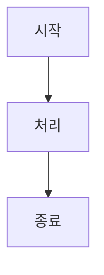

# FAQ

SEPilot Wiki 사용에 관한 자주 묻는 질문과 답변입니다.

## 일반

### SEPilot Wiki란 무엇인가요?

SEPilot Wiki는 AI 에이전트 기반의 자동화된 위키 시스템입니다. GitHub 저장소의 `/wiki` 폴더를 데이터 저장소로 활용하고, GitHub Issues를 통해 사용자와 소통하며, AI가 문서를 자동으로 생성/수정/유지보수합니다.

### 어떤 기술 스택을 사용하나요?

- **Frontend**: React 18 + TypeScript + Vite
- **State Management**: TanStack Query
- **Routing**: React Router 7
- **Hosting**: GitHub Pages
- **CI/CD**: GitHub Actions

## 문서 작성

### AI에게 문서 작성을 요청하려면 어떻게 하나요?

1. GitHub Issues에서 새 이슈를 생성합니다
2. `request` 라벨을 추가합니다
3. 이슈 본문에 원하는 문서의 내용을 설명합니다
4. AI가 자동으로 문서 초안을 작성합니다

### 직접 문서를 추가하려면 어떻게 하나요?

`/wiki` 폴더에 마크다운 파일을 직접 추가할 수 있습니다:

```markdown
---
title: "문서 제목"
description: "문서 설명"
category: "카테고리"
tags: ["태그1", "태그2"]
status: "published"
---

# 문서 내용
```

### 문서 수정을 요청하려면 어떻게 하나요?

해당 문서와 관련된 이슈에 댓글로 수정 사항을 작성하면 AI가 피드백을 반영하여 문서를 업데이트합니다.

## 기능

### 검색은 어떻게 작동하나요?

Fuse.js 기반의 전문 검색(Full-text search)을 지원합니다. 문서 제목, 내용, 태그 등을 대상으로 검색하며, 2자 이상 입력 시 검색이 시작됩니다.

### 다크 모드를 지원하나요?

예, 라이트/다크/시스템 테마를 지원합니다. 우측 상단의 테마 토글 버튼으로 변경할 수 있습니다.

### Mermaid 다이어그램을 사용할 수 있나요?

예, 마크다운 코드 블록에서 `mermaid` 언어를 지정하면 다이어그램이 렌더링됩니다:

~~~markdown

~~~

### Plotly 차트도 지원하나요?

예, `plotly` 코드 블록으로 인터랙티브 차트를 추가할 수 있습니다:

~~~markdown
```plotly
{
  "data": [{"x": [1, 2, 3], "y": [2, 6, 3], "type": "scatter"}],
  "layout": {"title": "샘플 차트"}
}
```
~~~

## 문제 해결

### 페이지가 404 오류를 표시합니다

GitHub Pages의 SPA 라우팅 특성상, 직접 URL 접근 시 404가 발생할 수 있습니다. 새로고침하거나 홈페이지에서 네비게이션을 통해 접근해 보세요.

### 문서가 목록에 표시되지 않습니다

- 프론트매터의 `status`가 `published`인지 확인하세요
- 파일 확장자가 `.md`인지 확인하세요
- GitHub Actions 배포가 완료되었는지 확인하세요 (약 2-3분 소요)

### AI가 문서를 생성하지 않습니다

- 이슈에 `request` 라벨이 추가되었는지 확인하세요
- GitHub Actions 워크플로우가 활성화되어 있는지 확인하세요
- 워크플로우 실행 로그에서 오류를 확인하세요

## 기여

### 프로젝트에 기여하려면 어떻게 하나요?

1. 이슈를 통해 기능 제안 또는 버그 리포트
2. `request` 라벨로 문서 작성 요청
3. PR을 통한 직접 코드 기여

### 코드 스타일 가이드가 있나요?

- ESLint + Prettier 설정을 준수합니다
- TypeScript strict 모드를 사용합니다
- 커밋 전 `bun run lint` 검사를 통과해야 합니다
