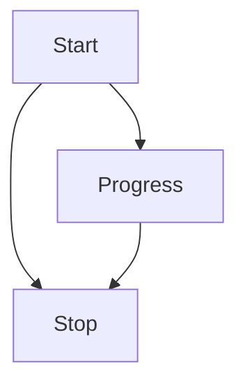
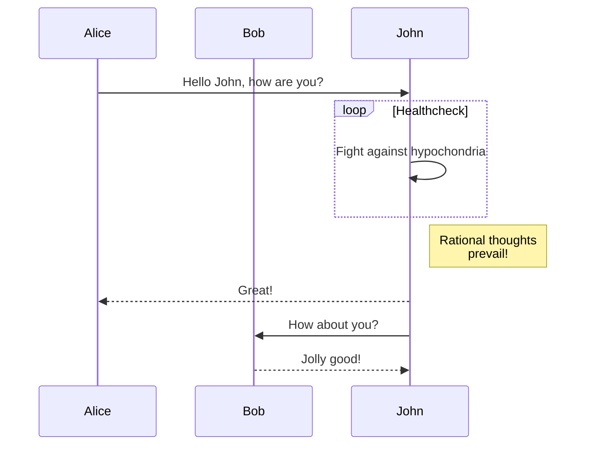
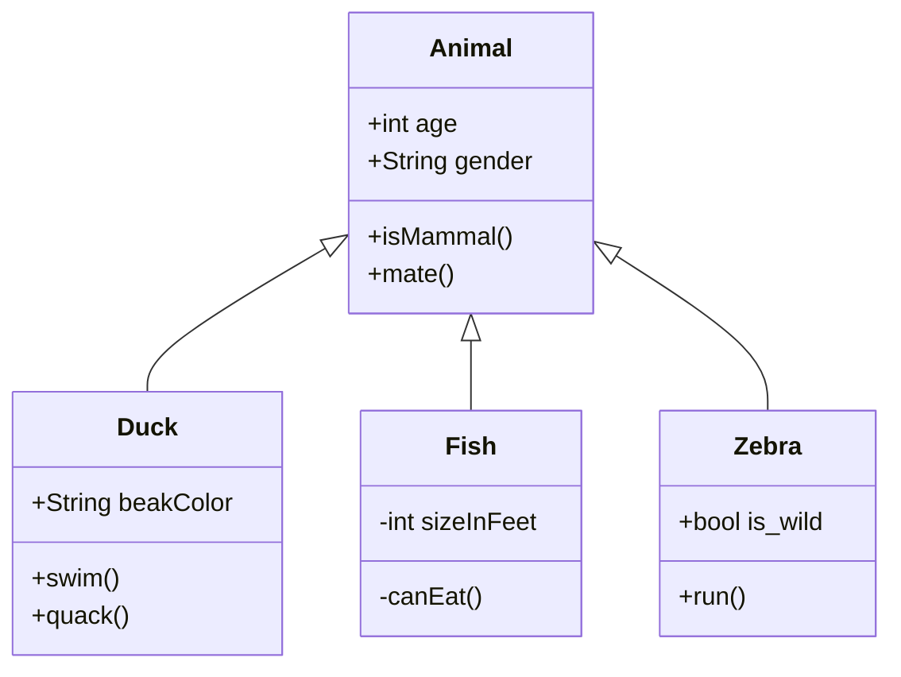

# 다이어그램 및 차트 사용 가이드

SEPilot Wiki는 복잡한 아이디어와 데이터를 시각화하기 위해 **Mermaid**와 **Plotly**를 지원합니다.
마크다운 코드 블록을 사용하여 간편하게 다이어그램과 차트를 그릴 수 있습니다.

## Mermaid 다이어그램

`mermaid` 언어로 코드 블록을 작성하면 자동으로 다이어그램으로 렌더링됩니다.

### 플로우차트 (Flowchart)



````markdown

````

### 시퀀스 다이어그램 (Sequence Diagram)



````markdown

````

### 클래스 다이어그램 (Class Diagram)



````markdown

````

더 많은 문법은 [Mermaid 공식 문서](https://mermaid.js.org/intro/)를 참고하세요.

## Plotly 차트

`plotly` 언어로 코드 블록을 작성하고 JSON 데이터를 입력하면 인터랙티브 차트가 생성됩니다.
데이터 구조는 [Plotly.js](https://plotly.com/javascript/) 스펙을 따릅니다.

### 기본 라인 차트

```plotly
{
  "data": [
    {
      "x": [1, 2, 3, 4],
      "y": [10, 15, 13, 17],
      "type": "scatter"
    }
  ],
  "layout": {
    "title": "기본 라인 차트"
  }
}
```

````markdown
```plotly
{
  "data": [
    {
      "x": [1, 2, 3, 4],
      "y": [10, 15, 13, 17],
      "type": "scatter"
    }
  ],
  "layout": {
    "title": "기본 라인 차트"
  }
}
````

### 바 차트 (Bar Chart)

```plotly
{
  "data": [
    {
      "x": ["지라프", "오랑우탄", "원숭이"],
      "y": [20, 14, 23],
      "type": "bar"
    }
  ],
  "layout": {
    "title": "동물원 통계"
  }
}
```

````markdown
```plotly
{
  "data": [
    {
      "x": ["지라프", "오랑우탄", "원숭이"],
      "y": [20, 14, 23],
      "type": "bar"
    }
  ],
  "layout": {
    "title": "동물원 통계"
  }
}
````

## 문법 강조 (Syntax Highlighting)

다양한 프로그래밍 언어의 문법 강조를 지원합니다.

```typescript
function hello(name: string) {
  console.log(`Hello, ${name}!`);
}
```

```python
def fib(n):
    a, b = 0, 1
    while a < n:
        print(a, end=' ')
        a, b = b, a+b
```

```css
.container {
  display: flex;
  justify-content: center;
}
```
