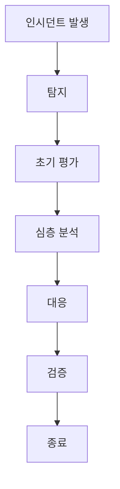

## 1. 서문
- **문서 목적**: WordPress 사이트 운영·보안 팀이 최신 취약점 정보를 신속히 파악하고, 체계적인 트라이아징(취약점 분류·우선순위 지정) 과정을 통해 적절한 대응을 수행하도록 가이드한다.  
- **대상 독자**: 보안 엔지니어, 개발자, 운영 담당자, 경영진 등 WordPress 생태계 전반에 걸친 이해관계자.  
- **2026년 WordPress 취약점 환경 개요**  
  - 2025‑2026년 사이 자동화 공격이 급증하고, 플러그인·테마 취약점이 전체 침해 사건의 70% 이상을 차지한다는 보고가 있다[^1][^2].  
  - 핵심 위협은 **크리덴셜 스터핑**, **파일 인클루전**, **플러그인 원격 코드 실행** 등이다.  
- **Playbook 적용 범위와 한계**  
  - 적용 대상: WordPress 코어, 공식·비공식 플러그인, 테마, 커스텀 코드.  
  - 한계: 제3자 SaaS 보안 서비스(예: Cloudflare WAF)와의 직접 연동은 별도 가이드가 필요하다.

## 2. 용어 정의 및 기본 개념
| 용어 | 정의 |
|------|------|
| **취약점(Vulnerability)** | 공격자가 악용할 수 있는 시스템·소프트웨어의 보안 결함. |
| **결함(Defect)** | 기능적·성능적 오류로, 반드시 보안 위험을 의미하지는 않는다. |
| **트라이아징(Triaging)** | 수집된 취약점 정보를 **분류 → 위험도 평가 → 우선순위 지정**하는 프로세스. |
| **CVSS** | Common Vulnerability Scoring System, 객관적인 위험도 점수를 제공한다. |
| **WPVSS** | WordPress Vulnerability Scoring System, WordPress 특화 가중치를 적용한다(예: 플러그인 인기·활성화 비율). |
| **주요 이해관계자** | 개발, 운영, 보안, 경영(경영진·법무·컴플라이언스) 팀. |

## 3. 최신 위협 동향 및 인텔리전스 소스
- **실시간 피드**  
  - **euno.news**: 자동화된 뉴스 인텔리전스 플랫폼으로 WordPress 취약점 관련 기사·CVE 정보를 RSS/JSON 형태로 제공한다[^3].  
  - **Wordfence**: 매주 발표되는 위협 인텔리전스 레포트와 실시간 악성 IP 차단 리스트.  
  - **Patchstack**: 플러그인·테마 취약점 데이터베이스와 자동 알림 서비스.  
- **2025‑2026년 주요 사례**  
  - 코어 6.5.2에서 발견된 **REST API 인증 우회** 취약점(공개 전후 48시간 내 악용 사례 다수) – 상세 내용은 Patchstack 보고서에 정리됨[^2].  
  - 인기 플러그인 “Contact Form 7”에서 **파일 업로드 무결성 검증 부재**가 발견되어 대규모 스팸·악성코드 배포에 이용된 사례가 보고되었다[^1].  
- **자동화 공격 트렌드**  
  - **크리덴셜 스터핑**: 로그인 시도 자동화 도구가 WordPress 기본 로그인 페이지를 목표로 10배 이상 증가.  
  - **파일 인클루전**: 취약한 플러그인 경로를 이용한 원격 파일 포함 공격이 지속적으로 보고되고 있다[^4].

## 4. 트라이아징 프로세스 전체 흐름

- **단계별 책임**  
  - **탐지**: SOC·IDS 팀 → 15분 이내 티켓 생성 (SLA).  
  - **초기 평가**: 보안 분석가 → 30분 이내 위험도 초안 산정.  
  - **심층 분석**: 개발·보안 협업 → 2시간 이내 재현 테스트.  
  - **대응**: 운영·개발 → 패치 적용·임시 완화.  
  - **검증**: QA·보안 → 회귀 테스트 완료 후 승인.  
  - **종료**: PMO → 포스트모템 기록 및 보고.  

## 5. 취약점 탐지 및 수집
- **로그·IDS/IPS 연동**  
  - Apache/Nginx 액세스 로그, ModSecurity 이벤트, Wordfence 알림을 중앙 로그 수집기(ELK, Splunk)와 연동.  
- **외부 인텔리전스 자동 파싱**  
  - `euno.news` API (예: `GET https://api.euno.news/v1/wordpress`)를 주기적으로 호출하여 신규 CVE·보안 기사 추출[^3].  
- **데이터 정규화 및 티켓 생성 규칙**  
  - 필수 필드: `취약점 ID`, `발견 일시`, `소스(euno.news, Wordfence 등)`, `심각도(초기)`, `관련 플러그인/테마`.  
  - 자동 티켓 생성은 Jira Service Management 혹은 GitHub Issues와 연동한다.

## 6. 초기 평가 및 분류
- **자동 분류 기준**  
  - **플러그인/코어/테마** 구분.  
  - **공개 여부**: CVE 번호가 부여된 경우 vs. 비공개(제로데이) 여부.  
  - **공격 경로**: 웹 UI, REST API, 파일 업로드 등.  
- **위험도 초기 스코어링**  
  - `CVSS 기본점수`에 **WPVSS 가중치**(플러그인 인기·활성화 비율) 적용. 구체적인 가중치 비율은 내부 정책에 따라 정의한다(추가 조사가 필요합니다).  
- **우선순위 결정 매트릭스**  
  - **비즈니스 영향**: 서비스 가용성, 고객 데이터 보호 수준.  
  - **노출 범위**: 전체 사이트 vs. 특정 서브도메인.  
  - 매트릭스 예시:  
    - **높음**: CVSS ≥7.0 + WPVSS 가중치 ≥1.5 + 고가용성 서비스.  
    - **중간**: CVSS 4‑6.9 또는 제한된 플러그인.  
    - **낮음**: CVSS <4.0 및 비활성 플러그인.  

## 7. 심층 분석 절차
1. **재현 테스트 환경 구축**  
   - Docker 기반 WordPress 공식 이미지(`wordpress:6.5`)와 동일 버전 플러그인·테마를 사용한다.  
   - 스냅샷을 이용해 원본 환경 복구 가능하도록 구성.  
2. **코드 리뷰·정적 분석**  
   - `phpstan`, `Psalm` 등 정적 분석 도구와 WordPress 코어 코딩 표준을 적용한다.  
   - 플러그인·테마 소스는 GitHub Advanced Security(Dependabot)와 연동해 의존성 취약점도 확인한다.  
3. **공격 시나리오 모델링**  
   - 취약점이 실제 악용될 경우의 **피해 경로**(예: 권한 상승 → 데이터 탈취) 를 시각화하고, 영향도를 정량화한다.  

## 8. 대응 및 완화 조치
- **패치 적용 가이드**  
  - **코어**: 공식 릴리즈가 나오면 `wp core update` 명령어로 자동 업데이트.  
  - **플러그인/테마**: `wp plugin update <slug>` / `wp theme update <slug>` 사용.  
  - 패치 전후 **스테이징** 환경에서 회귀 테스트 수행.  
- **임시 완화**  
  - 위험 플러그인 비활성화: `wp plugin deactivate <slug>`  
  - WAF 룰 추가: `SecRule REQUEST_URI "@contains /wp-json"` 차단 (ModSecurity 예시).  
  - `.htaccess` 차단: `RewriteRule ^.*(vulnerable.php)$ - [F]`  
- **롤백·백업 전략**  
  - 데이터베이스와 파일 시스템을 24시간 주기로 스냅샷 백업.  
  - 롤백 시 `wp db import`와 `wp core download --force`를 활용한다.  

## 9. 검증 및 재평가
- **보안 회귀 테스트**  
  - WPScan, Nessus, OpenVAS 등 자동 스캐너를 CI 파이프라인에 통합하여 배포 전 검증.  
- **위험도 재산정**  
  - 패치 적용 후 CVSS 점수를 재계산하고, WPVSS 가중치를 재적용한다.  
- **변경 관리와 CI/CD 연동**  
  - GitHub Actions 예시:  
    - `on: push` → `jobs: security-scan` → `wp scan` → 결과를 PR 코멘트에 자동 삽입.  

## 10. 커뮤니케이션 및 보고
- **내부 알림 템플릿** (Slack/Email)  
  ```
  [⚠️ WordPress 취약점 알림]  
  - ID: CVE-2026-XXXXX  
  - 영향: 플러그인 Contact Form 7 (버전 5.4)  
  - 위험도: 높음 (CVSS 8.2)  
  - 조치: 2026-02-26 14:00까지 패치 적용 필요  
  ```  
- **외부 공개 절차**  
  - 보안 공지 작성 → 고객 포털에 게시 → 필요 시 CVE 번호 신청(보안 벤더에 보고).  
- **이해관계자 보고서 포맷**  
  - 요약, 상세 분석, 대응 현황, 향후 계획을 포함한 2페이지 PDF 보고서.  

## 11. 사후 분석 및 개선
- **포스트모템 회고 항목**  
  - 원인 분석, 대응 시간(MTTR), 재발 방지 조치, 교훈 정리.  
- **프로세스 KPI**  
  - **MTTR**(Mean Time To Respond) 목표: 4시간 이내.  
  - **평균 위험도 감소**: 대응 후 평균 CVSS 점수 30% 감소 목표.  
- **문서·툴 업데이트 주기**  
  - 연 2회(상반기·하반기) 리뷰, 책임자: 보안 매니저.  

## 12. 자동화 및 도구 연계
- **CI/CD 파이프라인에 취약점 스캐너 통합**  
  - Jenkins: `stage('Security Scan') { steps { sh 'wp scan --format=json > scan.json' } }`  
  - GitHub Actions: `uses: wordpress/scan-action@v1`  
- **워크플로우 자동화**  
  - 티켓 자동 생성 → Slack 알림 → 패치 자동 PR 생성(Dependabot).  
- **중앙 관리 대시보드 설계**  
  - Grafana + Prometheus로 취약점 수, 평균 위험도, SLA 준수율 시각화.  

## 13. 거버넌스 및 컴플라이언스
- **정책 기반 접근 제어**  
  - 최소 권한 원칙 적용: WordPress 파일 시스템 권한 `755/644` 유지, 관리자 계정 MFA 적용.  
- **규제 연계 체크리스트**  
  - **GDPR**: 개인 데이터가 저장된 경우 침해 시 통지 절차 포함.  
  - **PCI DSS**: 결제 플러그인 취약점은 별도 위험도 가중치 적용(추가 조사가 필요합니다).  
- **감사 로그 보관**  
  - 모든 보안 이벤트와 티켓 변경 내역을 12개월 이상 보관하고, 정기적으로 무결성 검증 수행.  

## 14. 부록
### 용어 사전 및 약어
- **CVE**: Common Vulnerabilities and Exposures  
- **WPVSS**: WordPress Vulnerability Scoring System  
- **SLA**: Service Level Agreement  
- **MTTR**: Mean Time To Respond  

### 주요 인텔리전스 API 엔드포인트
| 서비스 | 엔드포인트 | 인증 방식 |
|--------|------------|-----------|
| euno.news | `https://api.euno.news/v1/wordpress` | API Key (Header `Authorization`) |
| Wordfence | `https://api.wordfence.com/v2/vulns` | Bearer Token |
| Patchstack | `https://api.patchstack.com/v1/vulns` | API Key |

### 샘플 티켓 템플릿
```
Title: [WP] CVE-2026-XXXXX – 플러그인 X 취약점
Description:
- 발견 일시: 2026-02-25 10:12 UTC
- 소스: euno.news
- CVSS: 8.2 (초기)
- 영향: 원격 코드 실행
- 현재 상태: 조사 중
Assignee: security-analyst
Due Date: 2026-02-26 14:00
```

## 15. 참고 문헌 및 리소스
- Sarwar, L. “WordPress Core Security 2026 — Part 1”. *SystemWeakness*. https://systemweakness.com/wordpress-core-security-2026-part-1-c86ce5d5e5f2 [^1]  
- Patchstack, Hosting.com, Human Made. “WordPress security 2026 best practices”. https://wpbakery.com/blog/wordpress-security-2026-best-practices/ [^2]  
- miniOrange. “10 WordPress Security Best Practices for 2026”. https://www.miniorange.com/blog/wordpress-security-best-practices/ [^3]  
- AdwaitX. “WordPress Security Best Practices 2026: Stop 96% of Breaches”. https://www.adwaitx.com/wordpress-security-best-practices/ [^4]  
- euno.news. “WordPress Vulnerability Triaging Playbook (Week of FE)”. https://euno.news/posts/ko/wordpress-vulnerability-triage-playbook-week-of-fe-22b457 [^5]  

*위 문서는 제공된 공개 자료를 기반으로 작성되었으며, 조직별 정책·인프라에 따라 세부 내용은 조정될 수 있습니다.*